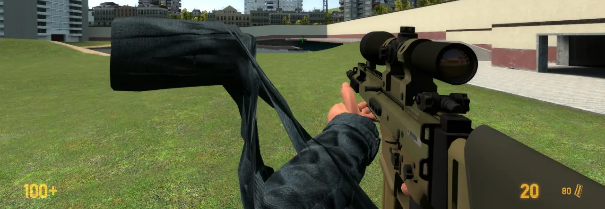

# SC Weapons

<steam-workshop itemid="3011567266"></steam-workshop>

> *Just Another Crappy SWEPs*

I know there are tons of admin guns in the Garry's Mod Workshop. But I couldn't find any add-ons that fit my desire, so I decided to make my own version of the admin gun.

While doing that, I've also decided to make my own SWEPs that aren't admin guns too.

## Weapon List

'SC Weapons' is made up of two parts. 'SC Admin Weapons' are literally admin weapons. 'SC Weapons' are weapons that even ordinary players can use.

### SC Admin Weapons

Every admin weapon shares the same mechanism unless specified.

* Admin MP5SD  
  Classname: `scaw_mp5sd`
* Admin MP5SD (Clean): Same with 'Admin MP5SD', but does not create a 'bullet hole'.  
  Classname: `scaw_mp5sd_clean`
* Admin Pistol  
  Classname: `scaw_pistol`
* Admin Pistol (Clean): Same with 'Admin Pistol', but does not create a 'bullet hole'.  
  Classname: `scaw_pistol_clean`

### SC Weapons

* Empty Hands  
  Classname: `scw_empty`
* Fast Crowbar  
  Classname: `scw_fastcrowbar`
* MP5SD  
  Classname: `scw_mp5sd`
* SCAR20  
  Classname: `scw_scar20`

## Known Issue

### Missing hands in SCAR20

Hands are removed because I couldn't figure out how to fix these distorted hands. No hands would be better than this.

***

## FAQ

### *NONE*
