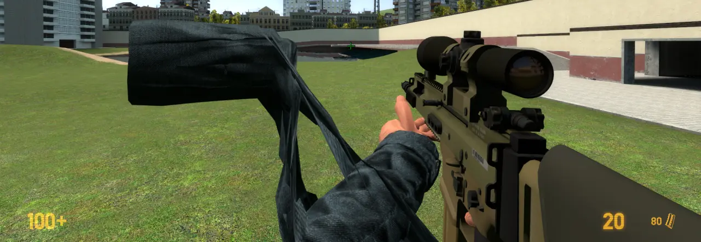

# SC Weapons

<steam-workshop itemid="3011567266"></steam-workshop>

> *Just Another Crappy SWEPs*

SC Weapons is split into two groups:

* [SC Weapons](scw.md): player-usable SWEPs, including utility weapons and MMod-inspired HL2 weapons.
* [SC Admin Weapons](scaw.md): SuperAdmin-focused weapons with extreme damage and selectable secondary fire modes.

## Weapon List

### SC Weapons

| Weapon | Classname | Notes |
| --- | --- | --- |
| Empty Hands | `scw_empty` | Mimics an unarmed/no-weapon state. |
| Fast Crowbar | `scw_fastcrowbar` | HL2 crowbar behavior with a much faster attack delay. |
| MP5SD | `scw_mp5sd` | Suppressed SMG-style weapon with grenade secondary fire. |
| Pulse Rifle (MMod) | `scw_mm_ar2` | MMod-style AR2 with ramping spread and combine ball alt-fire. |
| Shotgun (MMod) | `scw_mm_shotgun` | MMod-style SPAS-12 with single and double-shot fire. |
| SMG (MMod) | `scw_mm_smg1` | MMod-style SMG1 with grenade launcher secondary fire. |
| SCAR20 | `scw_scar20` | Accurate crossbow-ammo rifle with zoom. |

### SC Admin Weapons

| Weapon | Classname | Notes |
| --- | --- | --- |
| Admin MP5 | `scaw_mp5` | Admin version of the MP5. |
| Admin MP5 (Clean) | `scaw_mp5_clean` | Same as Admin MP5 but does not create bullet holes. |
| Admin MP5SD | `scaw_mp5sd` | Admin version of the MP5SD. |
| Admin MP5SD (Clean) | `scaw_mp5sd_clean` | Same as Admin MP5SD but does not create bullet holes. |
| Admin Pistol | `scaw_pistol` | Admin version of the pistol. |
| Admin Pistol (Clean) | `scaw_pistol_clean` | Same as Admin Pistol but does not create bullet holes. |

## NPC Usable Weapons

These weapons are registered for NPC weapon selection:

* `scaw_mp5`
* `scaw_mp5_clean`
* `scaw_mp5sd`
* `scaw_mp5sd_clean`
* `scaw_pistol`
* `scaw_pistol_clean`
* `scw_mm_ar2`
* `scw_mm_smg1`
* `scw_mp5sd`

## Settings

SC Weapons adds a settings page at:

``` plaintext
Utilities > SC Weapons > Settings
```

The settings page controls the default secondary fire mode for admin weapons and owner immunity for Explosion Mode.

## Known Issue

### Missing hands in SCAR20

SCAR20 still has an issue with distorted viewmodel hands. The hands are not reliable enough to document as fixed, so treat this as an ongoing known issue.


